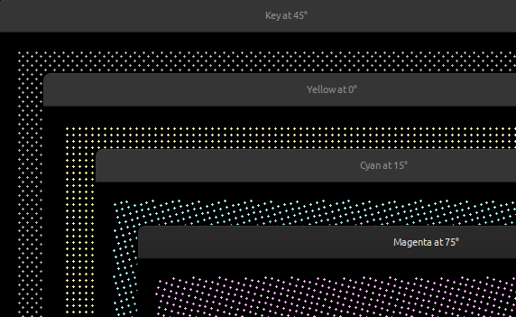

# Rotated grids in Rust

🎨 _For halftone dithering and more._

---

This crate provides a generator for enumerating grid coordinates at a specified frequency along a rotated grid.
This can come in useful e.g. when you want to create halftone dithering grids for CMYK processing:

<div align="center" style="text-align: center">
    
</div>

## Usage example

```rust
use rotated_grid::{Angle, GridPositionIterator, GridCoordinate};

const WIDTH: usize = 16;
const HEIGHT: usize = 10;

fn main() {
    let halftone_grids = [
        ("Cyan", 15.0),
        ("Magenta", 75.0),
        ("Yellow", 0.0),
        ("Black", 45.0),
    ];
    
    for (name, angle) in halftone_grids {
        println!("{name} at {angle}°", name = name, angle = angle);
    
        let grid = GridPositionIterator::new(
            WIDTH as _,
            HEIGHT as _,
            7.0,
            7.0,
            0.0,
            0.0,
            Angle::<f64>::from_degrees(angle),
        );
    
        let (_, expected_max) = grid.size_hint();
        let mut count = 0;
    
        for GridCoordinate { x, y } in grid {
            println!("{x}, {y}", x = x, y = y);
            count += 1;
        }
    
        assert!(count <= expected_max.unwrap())
    }
}
```

You can run the example application using

```shell
cargo run --package cmyk
```
